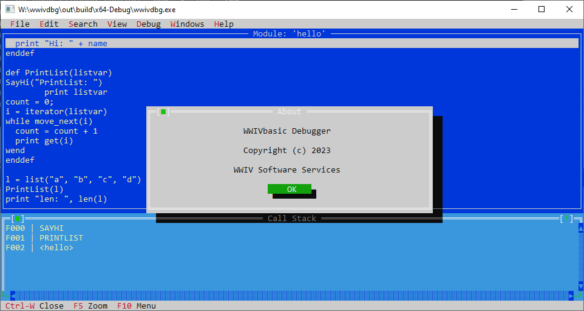
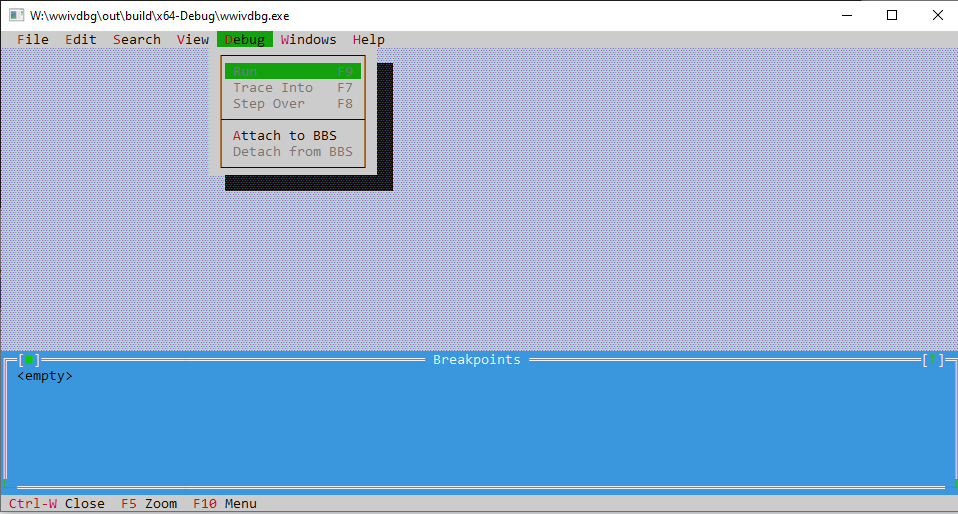
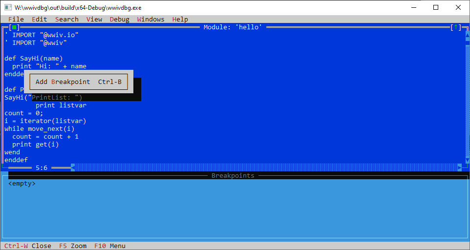
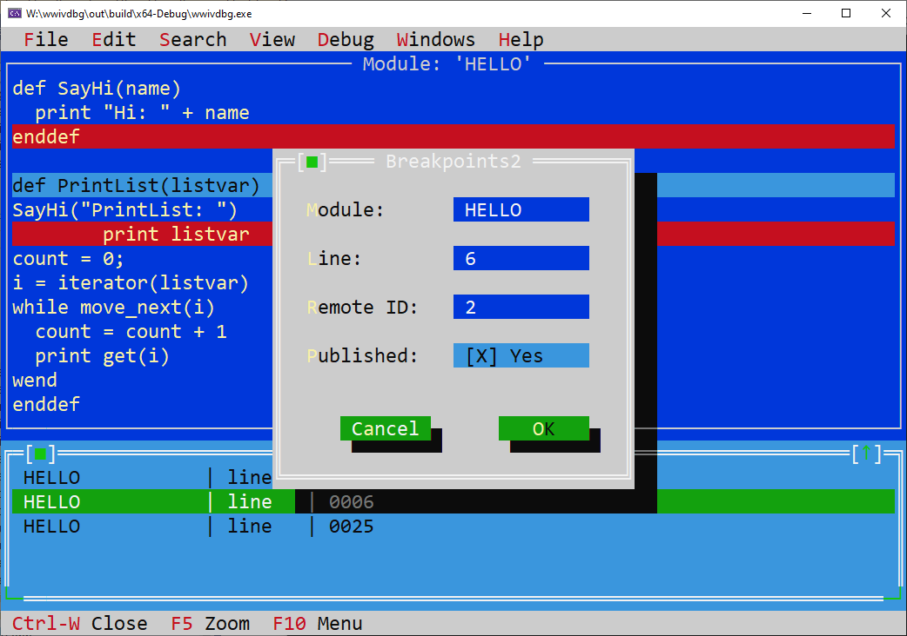
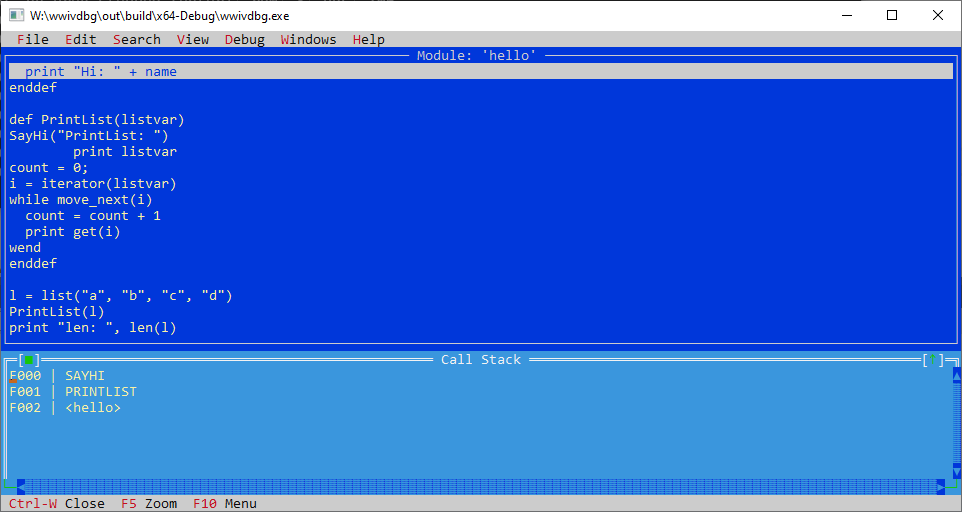
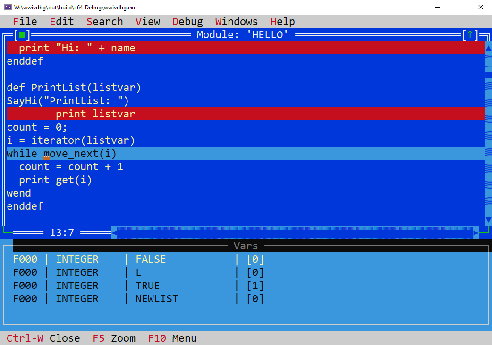

# WWIVbasic Debugger

The WWIVbasic debuger (wwivdbg.exe) is the Text modem (TUI) debugger
for debugging WWIVbasic scripts.

## Getting started

1. You must build a latest 5.9 WWIV BBSh here:
   https://github.com/wwivbbs/wwiv
   See https://github.com/wwivbbs/wwiv/blob/main/README.md for
   more information on building WWIV.

2. You must build wwivdbg.  It builds with cmake and vcpkg, so is
   relatively straightforward using commands like:

```shell

mkdir _build
cd _build 
../cmake-config.sh 
cmake --build .

```

3. To execute a script in debug mode, use the following command:

``` bbs -d --run_basic=SCRIPT.BAS ```

where ```script.bas``` is the name of a file located in the scripts/ 
directory configured in WWIVconfig.  This is typically just a directory
under the WWIV home dir named ```scripts```.

The ```-d``` command line parameter will cause *every* script invocation
to wait for the debuger to attach before executing, so only use it when
you are running and debuging things locally as sysop.

4. Screenshots


















